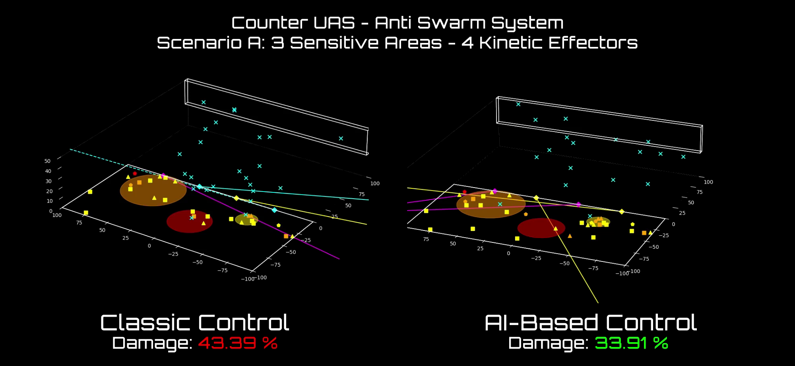
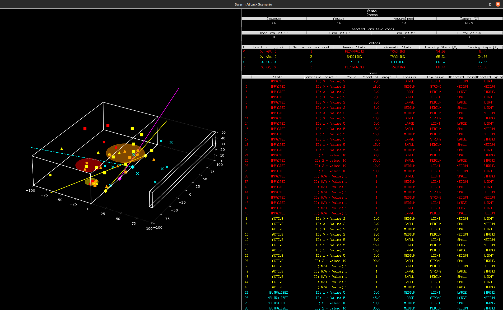
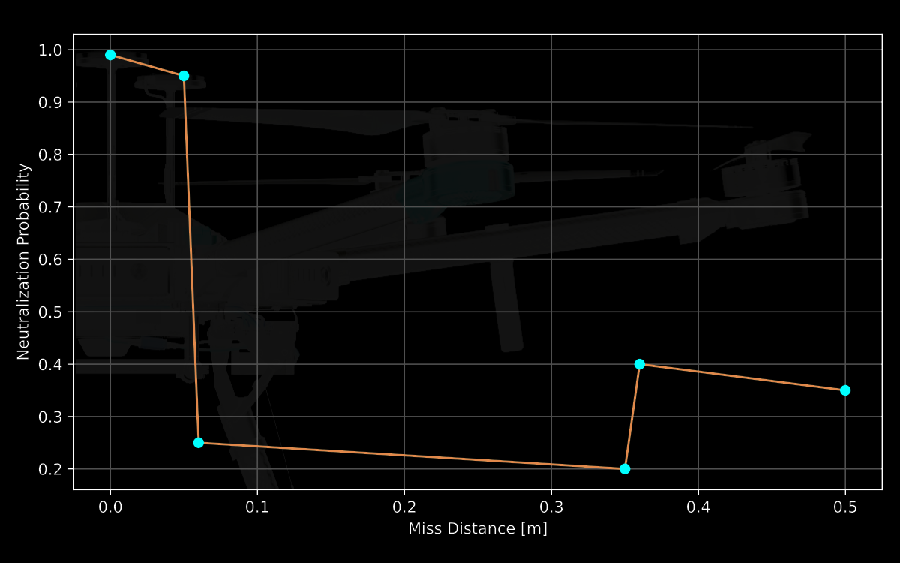
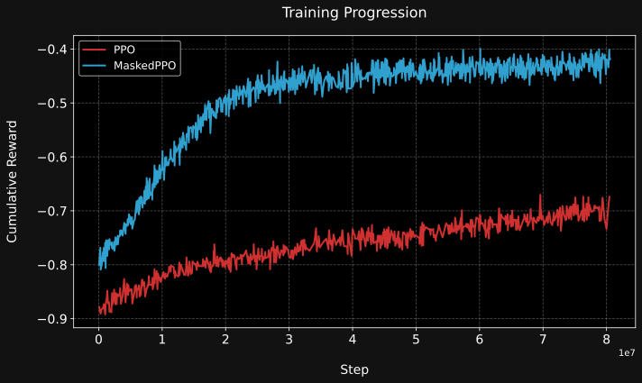
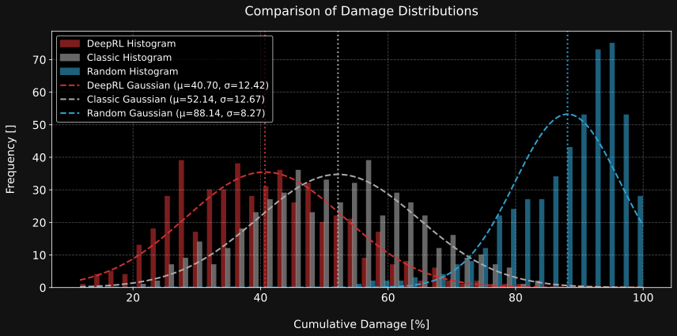
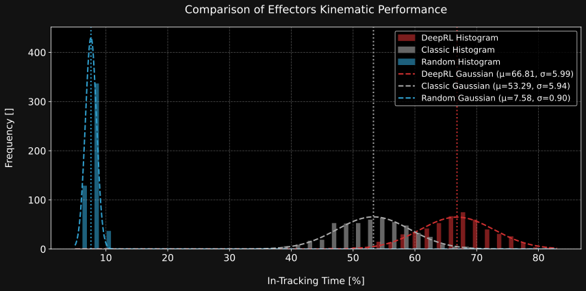
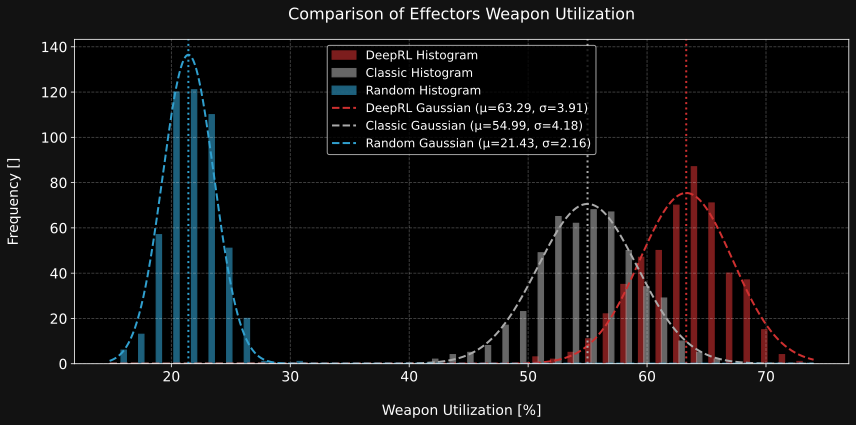
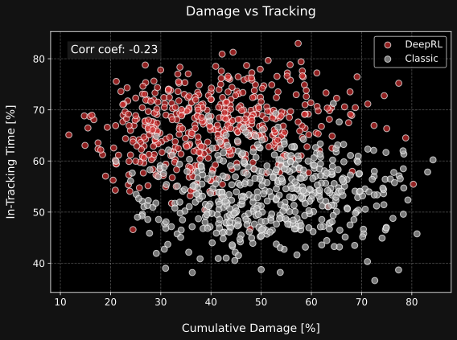
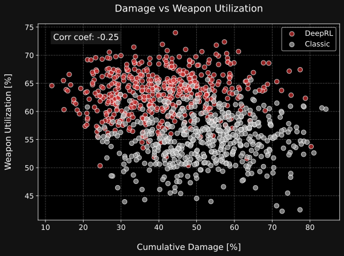

<p align="center">
    
</p>

<p align="center">
<a href="https://arxiv.org/abs/2508.00641"></a>
</p>

<p align="center">
<a href="https://alexpalms.github.io/projects/02-rl_cuas/"></a>
<a href="https://artificialtwin.com/projects/cuas/"></a>
</p>

<p align="center">
<a href="https://github.com/alexpalms/deeprl-counter-uav-swarm/actions/workflows/code-checks.yaml"></a>
<a href="https://github.com/alexpalms/deeprl-counter-uav-swarm/actions/workflows/pytest.yaml"></a>
<a href="https://codecov.io/github/alexpalms/deeprl-counter-uav-swarm"></a>
</p>

<p align="center">


</p>
<p align="center">

</p>


# Aprendizaje por Refuerzo para la Priorización de Intercepción a Nivel de Decisión en la Defensa contra Enjambres de Drones

Este repositorio contiene un marco de trabajo de aprendizaje por refuerzo (RL, por sus siglas en inglés) para la priorización de intercepción a nivel de decisión en enjambres de drones. El proyecto está diseñado para evaluar el rendimiento de los agentes de RL frente a métodos heurísticos clásicos en un entorno simulado, centrándose en la intercepción de drones hostiles mediante efectores cinéticos para minimizar el daño en zonas sensibles.

Los agentes de RL se entrenan para priorizar los objetivos de drones en función de sus niveles de amenaza potenciales, con el objetivo de maximizar la efectividad del sistema de defensa mientras se minimiza el daño colateral.

<!--Esta base de código integra y completa el trabajo presentado en el artículo "Reinforcement Learning for Decision-Level Interception Prioritization in Drone Swarm Defense", que se puede encontrar [aquí](https://arxiv.org/abs/2401.12345).-->

## Configuración

**Todo en esta guía asume que está utilizando un sistema operativo Linux**

- Instale `uv` ([Ref](https://github.com/astral-sh/uv)) (Ej. `curl -LsSf https://astral.sh/uv/install.sh | sh`)
- Instale los paquetes: `uv sync`

## Simulador

El simulador modela un escenario de defensa donde un enjambre de drones kamikaze apunta autónomamente a zonas de alto valor protegidas por efectores cinéticos (como interceptores o armas de energía dirigida). El entorno es tridimensional e incluye cantidades configurables de drones hostiles, zonas sensibles estáticas y efectores con dinámicas cinemáticas y de armas realistas. Cada efector solo puede disparar cuando está bloqueado en un objetivo y está listo, y debe recargarse periódicamente.

Los episodios comienzan con drones generados en ubicaciones aleatorias, cada uno apuntando a una zona mediante políticas predefinidas pero desconocidas. El defensor recibe observaciones parciales con ruido y debe priorizar qué drones interceptar en cada paso de tiempo, considerando restricciones como la velocidad de disparo limitada, la velocidad angular y la línea de visión. La simulación admite escenarios a gran escala, multiagente y evaluación por lotes.

Los atacantes varían en velocidad, tamaño, poder explosivo y trayectoria de vuelo, y su coordinación es fija para simular adversarios de bajo costo. El desafío del defensor es minimizar el daño total tomando decisiones de priorización efectivas en tiempo real bajo incertidumbre y limitaciones de recursos. Todos los elementos del escenario, incluidas las zonas, drones, efectores y sensores, son altamente configurables para una experimentación flexible.

Las siguientes figuras ilustran aspectos clave del entorno de simulación. La primera imagen muestra el simulador del escenario en ejecución, incluyendo todos los elementos gráficos relevantes como los estados de los drones y efectores, y las zonas protegidas. La segunda imagen presenta la probabilidad de neutralización del drone en función de la distancia de error, ofreciendo una perspectiva sobre la efectividad del sistema de defensa bajo diferentes condiciones de enfrentamiento.

<table>
  <tr>
    <td width="50%"></td>
    <td width="50%"></td>
  </tr>
  <tr>
    <td align="center">Simulador del Escenario en Ejecución</td>
    <td align="center">Gráfico de Probabilidad de Neutralización del Drone</td>
  </tr>
</table>

## Entrenamiento

Para entrenar un nuevo agente de aprendizaje por refuerzo, configure sus parámetros de entrenamiento en un archivo de configuración como [`examples/config.yaml`](examples/config.yaml) y ejecute el entrenamiento a través de la CLI:

```
uv run rl-cuas-cli train --config ./examples/config.yaml
```

El script admite la recuperación desde puntos de control, guardado automático, evaluación durante el entrenamiento y parada temprana basada en umbrales de recompensa o falta de mejora. Los entornos de entrenamiento y evaluación, los puntos de control del modelo y los registros se gestionan automáticamente según su configuración.

Hay dos versiones del algoritmo PPO disponibles: el PPO original y el MaskablePPO (que admite enmascaramiento de acciones para acciones inválidas), ambos proporcionados a través de Stable Baselines 3. Puede seleccionar qué algoritmo utilizar estableciendo el campo `algo` en su archivo de configuración.

La siguiente imagen muestra una comparación de las curvas de entrenamiento entre PPO y MaskablePPO:

<table>
  <tr>
    <td align="center" width="100%"></td>
  </tr>
  <tr>
    <td align="center">Rendimiento de entrenamiento de PPO vs. MaskedPPO, que muestra la recompensa acumulada por episodio a lo largo de los pasos del entorno. MaskedPPO converge ~10× más rápido al enmascarar acciones inválidas (p. ej., apuntar a drones ya neutralizados), lo que permite un aprendizaje más eficiente y estable.</td>
  </tr>
</table>

## Evaluación y Resultados

Para ejecutar un solo episodio de inferencia y visualizar o evaluar una política específica (p. ej., DeepRL, Classic o Random), utilice el comando `evaluate` de la CLI. Esto le permite observar el comportamiento y el rendimiento del agente en el entorno. Por ejemplo, para ejecutar un solo episodio con la política DeepRL y el renderizado habilitado, utilice:
```
uv run rl-cuas-cli evaluate --policy deeprl --n_episodes 1 --seed 42
```
Puede cambiar el argumento `--policy` a `classic` o `random` para evaluar otras políticas. Utilice la bandera `--no_render` para deshabilitar la visualización y acelerar la evaluación.

Para una comparación exhaustiva de todas las políticas y la generación automática de gráficos y métricas de evaluación, utilice el comando `compare` de la CLI. Esto ejecuta múltiples episodios para cada política, agrega los resultados y produce todos los gráficos y tablas resumen relevantes para daños, rastreo y utilización de armas:
```
uv run rl-cuas-cli compare --n_episodes 100 --seeds 10 20 30 42 50
```
El script guardará los resultados y figuras en las carpetas correspondientes, permitiendo un fácil análisis y reproducibilidad de la evaluación.

La siguiente tabla y figuras se generan utilizando los parámetros predeterminados del comando `compare`. Proporcionan un resumen exhaustivo de las principales métricas de evaluación y comparaciones visuales entre las diferentes políticas.


| Métrica                        | Heurística Clásica | Aprendizaje por Refuerzo |
|-------------------------------|:------------------:|:---------------------:|
| Daño Total (Prom.) [%]        | 52.14              | **40.70**             |
| Tiempo en Rastreo (Prom.) [%] | 53.29              | **66.81**             |
| Utilización de Armas (Prom.) [%]  | 54.99              | **63.29**             |

*Tabla: Resultados de Evaluación. 100 Episodios × 5 Semillas*


<table>
  <tr>
    <td width="50%"><a href="https://youtu.be/GooNFDk42Nw" target="_blank"></a></td>
    <td width="50%"></td>
  </tr>
  <tr>
    <td align="center"><a href="https://youtu.be/GooNFDk42Nw" target="_blank">Video de Demostración</a></td>
    <td align="center">Distribución del porcentaje de daño total de la zona para cada controlador. El agente de RL limita consistentemente el daño a las zonas críticas en comparación con la línea base heurística y el controlador aleatorio.</td>
  </tr>
</table>

<table>
  <tr>
    <td width="50%"></td>
    <td width="50%"></td>
  </tr>
  <tr>
    <td align="center">a) Rendimiento de Rastreo</td>
    <td align="center">b) Utilización de Armas</td>
  </tr>
  <tr>
    <td colspan="2" align="center">Comparación del rendimiento del controlador en dos métricas clave habilitantes: (a) eficiencia de rastreo de objetivos y (b) utilización de armas. La política DeepRL logra consistentemente un rendimiento superior en ambas categorías en comparación con los controladores clásicos y aleatorios, lo que indica una mejor asignación de recursos y un enfrentamiento sostenido contra las amenazas a lo largo del tiempo.</td>
  </tr>
</table>

<table>
  <tr>
    <td width="50%"></td>
    <td width="50%"></td>
  </tr>
  <tr>
    <td align="center">a) Correlación entre Daño y Rastreo</td>
    <td align="center">b) Correlación entre Daño y Utilización de Armas</td>
  </tr>
  <tr>
    <td colspan="2" align="center">Gráficos de dispersión que muestran la relación entre el daño de la zona y: (a) la eficiencia de rastreo, y (b) la utilización de armas. Aunque ambas correlaciones son negativas, no son fuertemente lineales, lo que destaca que las oportunidades de enfrentamiento aumentadas (mediante un mejor rastreo y utilización) generalmente ayudan a reducir el daño, pero no lo determinan por completo debido a la compleja interacción entre la priorización y el comportamiento de la amenaza.</td>
  </tr>
</table>

## Citación
```latex
@misc{palmas2025reinforcementlearningdecisionlevelinterception,
      title={Reinforcement Learning for Decision-Level Interception Prioritization in Drone Swarm Defense},
      author={Alessandro Palmas},
      year={2025},
      eprint={2508.00641},
      archivePrefix={arXiv},
      primaryClass={cs.LG},
      url={https://arxiv.org/abs/2508.00641},
}
```
