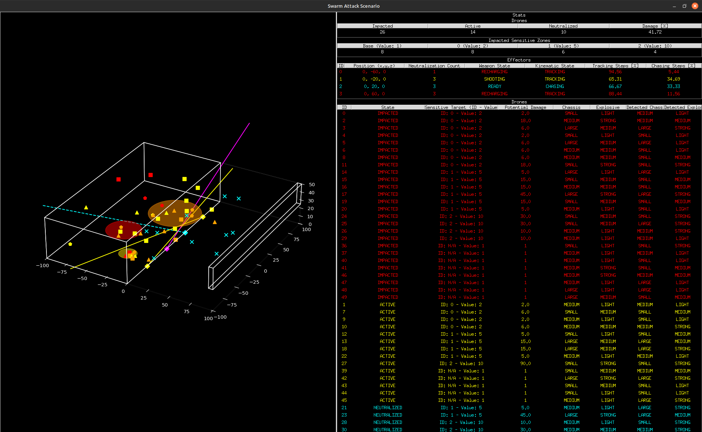
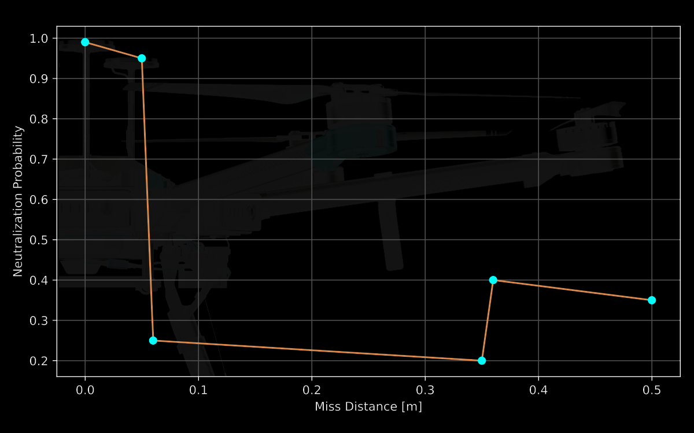
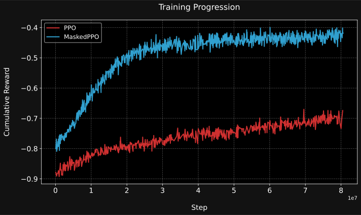
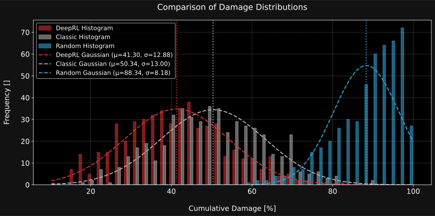
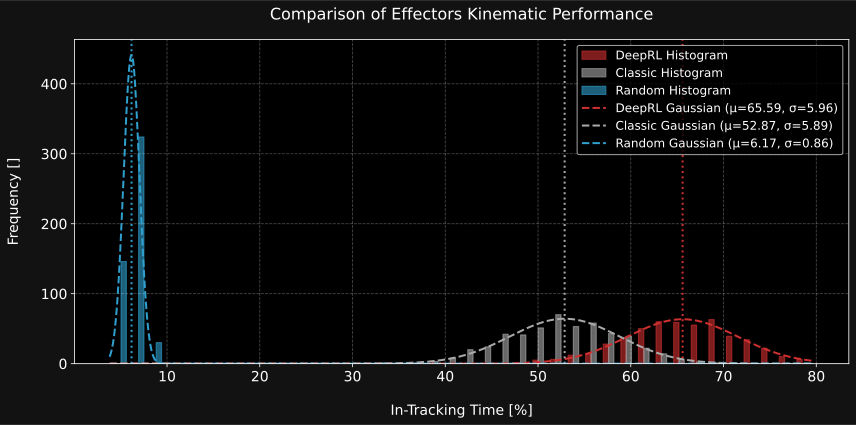
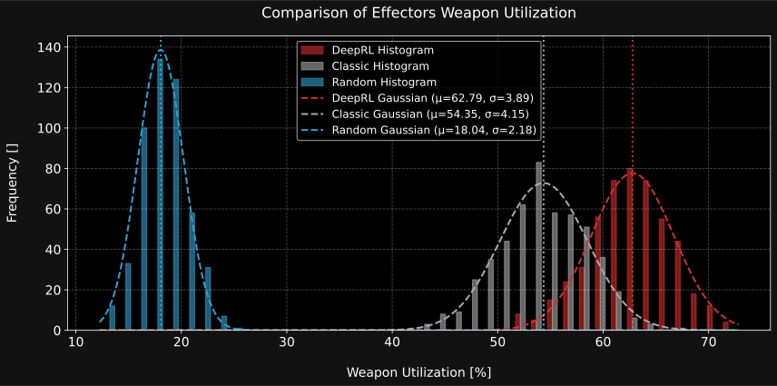
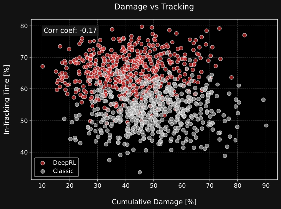
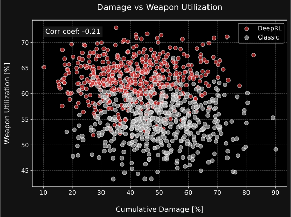

# Reinforcement Learning for Decision-Level Interception Prioritization in Drone Swarm Defense

# Overview


# Setup
```
conda create -n cuas python=3.11
conda activate cuas
```
```
pip install --no-cache-dir torch==2.5.1+cpu --index-url https://download.pytorch.org/whl/cpu; # For CPU-only systems
pip install -r requirements
```

# Simulator

<table>
  <tr>
    <td width="50%"></td>
    <td width="50%"></td>
  </tr>
  <tr>
    <td align="center">Scenario Simulator In Execution</td>
    <td align="center">Drone Neutralization Probability Plot</td>
  </tr>
</table>

# Training
<table>
  <tr>
    <td width="50%"></td>
  </tr>
  <tr>
    <td align="center">Training Curves</td>
  </tr>
</table>

# Evaluation and Results

| Metric                        | Classical Heuristic | Reinforcement Learning |
|-------------------------------|:------------------:|:---------------------:|
| Total Damage (Avg) [%]        | 50.34              | **41.30**             |
| In-Tracking Time (Avg) [%]    | 52.87              | **65.59**             |
| Weapon Utilization (Avg) [%]  | 54.35              | **62.79**             |

*Table: Evaluation Results. 100 Episodes × 5 Seeds*


<table>
  <tr>
    <td width="50%"><a href="https://youtu.be/GooNFDk42Nw" target="_blank"></a></td>
    <td width="50%"></td>
  </tr>
  <tr>
    <td align="center"><a href="https://youtu.be/GooNFDk42Nw" target="_blank">Demo Video</a></td>
    <td align="center">Damage Comparison</td>
  </tr>
</table>

<table>
  <tr>
    <td width="50%"></td>
    <td width="50%"></td>
  </tr>
  <tr>
    <td align="center">Tracking Performance</td>
    <td align="center">Weapon Utilization</td>
  </tr>
</table>

<table>
  <tr>
    <td width="50%"></td>
    <td width="50%"></td>
  </tr>
  <tr>
    <td align="center">Damage vs Tracking Correlation</td>
    <td align="center">Damage vs Weapon Utilization Correlation</td>
  </tr>
</table>

# Citation