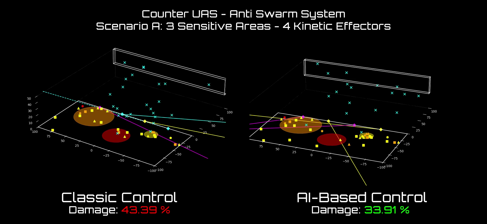

<p align="center">
    
</p>

<p align="center">
<a href="https://arxiv.org/abs/2210.10595"></a>
</p>

# Reinforcement Learning for Decision-Level Interception Prioritization in Drone Swarm Defense

This repository contains a reinforcement learning (RL) framework for the decision-level interception prioritization of drone swarms. The project is designed to evaluate the performance of RL agents against classical heuristic methods in a simulated environment, focusing on the interception of hostile drones by kinetic effectors to minimize damage to sensitive zones.

The RL agents are trained to prioritize drone targets based on their potential threat levels, with the goal of maximizing the effectiveness of the defense system while minimizing collateral damage.

This codebase integrates and completes the work presented in the paper "Reinforcement Learning for Decision-Level Interception Prioritization in Drone Swarm Defense", which can be found [here](https://arxiv.org/abs/2401.12345).

## Setup

To get started, create a new Python environment and install the required dependencies. The following commands will set up a Conda environment and install all necessary packages, including PyTorch for CPU-only systems and other requirements listed in the `requirements.txt` file:
```
conda create -n cuas python=3.11
conda activate cuas
```
```
pip install --no-cache-dir torch==2.5.1+cpu --index-url https://download.pytorch.org/whl/cpu; # For CPU-only systems
pip install -r requirements
```

## Simulator

The simulator models a defense scenario where a swarm of kamikaze drones autonomously targets high-value zones protected by kinetic effectors (such as interceptors or directed energy weapons). The environment is three-dimensional and includes configurable numbers of hostile drones, static sensitive zones, and effectors with realistic kinematic and weapon dynamics. Each effector can only fire when locked onto a target and ready, and must periodically recharge.

Episodes begin with drones spawned at random locations, each aiming for a zone using pre-defined but unknown policies. The defender receives noisy, partial observations and must prioritize which drones to intercept at every timestep, considering constraints like limited firing rate, angular speed, and line-of-sight. The simulation supports large-scale, multi-agent scenarios and batch evaluation.

Attackers vary in speed, size, explosive power, and flight path, and their coordination is fixed to simulate low-cost adversaries. The defender’s challenge is to minimize total damage by making effective, real-time prioritization decisions under uncertainty and resource limitations. All scenario elements, including zones, drones, effectors, and sensors, are highly configurable for flexible experimentation.

The following figures illustrate key aspects of the simulation environment. The first image shows the scenario simulator in execution, including all relevant infographics such as drone and effector states, and protected zones. The second image presents the drone neutralization probability as a function of miss distance, providing insight into the effectiveness of the defense system under varying engagement conditions.

<table>
  <tr>
    <td width="50%"></td>
    <td width="50%"></td>
  </tr>
  <tr>
    <td align="center">Scenario Simulator In Execution</td>
    <td align="center">Drone Neutralization Probability Plot</td>
  </tr>
</table>

## Training

To train a new reinforcement learning agent, configure your training parameters in [`train/config.yaml`](train/config.yaml) and run the training script:

```
python training.py --config train/config.yaml
```

The script supports resuming from checkpoints, automatic saving, evaluation during training, and early stopping based on reward thresholds or lack of improvement. Training and evaluation environments, model checkpoints, and logs are managed automatically according to your configuration.

Two versions of the PPO algorithm are available: the original PPO and the MaskablePPO (which supports action masking for invalid actions), both provided via Stable Baselines 3. You can select which algorithm to use by setting the `algo` field in your configuration file.

The following image shows a comparison of training curves between PPO and MaskablePPO:


<table>
  <tr>
    <td align="center" width="100%"></td>
  </tr>
  <tr>
    <td align="center">Training Curves</td>
  </tr>
</table>

## Evaluation and Results

To run a single inference episode and visualize or evaluate a specific policy (e.g., DeepRL, Classic, or Random), use the `inference.py` script. This allows you to observe the agent's behavior and performance in the environment. For example, to run a single episode with the DeepRL policy and rendering enabled, use:
```
python inference.py --policy deeprl --n_episodes 1 --seed 42
```
You can change the `--policy` argument to `classic` or `random` to evaluate other policies. Use the `--no_render` flag to disable visualization and speed up evaluation.

For a comprehensive comparison of all policies and automatic generation of evaluation figures and metrics, use the `comparative_evaluation.py` script. This script runs multiple episodes for each policy, aggregates the results, and produces all relevant plots and summary tables for damage, tracking, and weapon utilization:
```
python comparative_evaluation.py --n_episodes 100 --seeds 10 20 30 42 50
```
The script will save the results and figures in the appropriate folders, allowing for easy analysis and reproducibility of the evaluation.

The following table and figures are generated using the default parameters of the comparative evaluation script. They provide a comprehensive summary of the main evaluation metrics and and visual comparisons between the different policies.


| Metric                        | Classical Heuristic | Reinforcement Learning |
|-------------------------------|:------------------:|:---------------------:|
| Total Damage (Avg) [%]        | 50.34              | **41.30**             |
| In-Tracking Time (Avg) [%]    | 52.87              | **65.59**             |
| Weapon Utilization (Avg) [%]  | 54.35              | **62.79**             |

*Table: Evaluation Results. 100 Episodes × 5 Seeds*


<table>
  <tr>
    <td width="50%"><a href="https://youtu.be/GooNFDk42Nw" target="_blank"></a></td>
    <td width="50%"></td>
  </tr>
  <tr>
    <td align="center"><a href="https://youtu.be/GooNFDk42Nw" target="_blank">Demo Video</a></td>
    <td align="center">Damage Comparison</td>
  </tr>
</table>

<table>
  <tr>
    <td width="50%"></td>
    <td width="50%"></td>
  </tr>
  <tr>
    <td align="center">Tracking Performance</td>
    <td align="center">Weapon Utilization</td>
  </tr>
</table>

<table>
  <tr>
    <td width="50%"></td>
    <td width="50%"></td>
  </tr>
  <tr>
    <td align="center">Damage vs Tracking Correlation</td>
    <td align="center">Damage vs Weapon Utilization Correlation</td>
  </tr>
</table>

## Citation